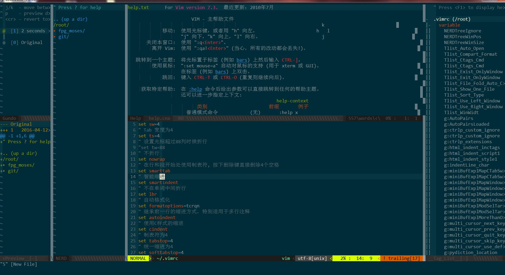

# 运行截图

# vim 脚本安装注意
- 若是Linux已经安装apt-get，直接运行 install.sh ;
- 若是系统为FPG，则执行FPG.sh ;

# vim 快捷键

| Button        | state               | 
| ------------- |:--------------------| 
| F1            | 帮助文档             | 
| F2            | 新建一个标签页        | 
| F3            | NERDTree 目录文件    | 
| F4            | 快速运行             |
| F5            | 编译运行             | 
| F6            | 代码格式优化、        | 
| F7            | winmanager 窗口管理  | 
| F8            | 代码调试             | 
| F9            | taglist 方法列表     | 
| F11           | 时光机               |
| F12           | 缩进重排             |

# vim 相关技巧

1.tab标签页命令：
> :tabnew [++opt选项] ［＋cmd］ 文件            建立对指定文件新的tab
> :tabc      关闭当前的tab
> :tabo      关闭所有其他的tab
> :tabs      查看所有打开的tab
> :tabp      前一个
> :tabn      后一个
> map <S-Left> :tabp<CR>
> map <S-Right> :tabn<CR>

2.分屏功能:
> 横向切割窗口
> :new+窗口名(保存后就是文件名)
> :split+窗口名，也可以简写为:sp+窗口名
> 纵向切割窗口名
> :vsplit+窗口名，也可以简写为：vsp+窗口名
> 窗口切换
> :ctrl+w+j/k，通过j/k可以上下切换，或者:ctrl+w加上下左右键，还可以通过快速双击ctrl+w依次切换窗口。
> 给窗口重命名
> :f file
> vi打开多文件
> vi a b c
> :n 跳至下一个文件，也可以直接指定要跳的文件，如:n c，可以直接跳到c文件
> :e# 回到刚才编辑的文件
> 文件浏览
> :Ex 开启目录浏览器，可以浏览当前目录下的所有文件，并可以选择
> :Sex 水平分割当前窗口，并在一个窗口中开启目录浏览器
> :ls 显示当前buffer情况
> vi与shell切换
> :shell 可以在不关闭vi的情况下切换到shell命令行
> :exit 从shell回到vi

3.文件对比功能：
> :vert diffsplit <file>
> nnoremap <C-F2> :vert diffsplit

4.模糊搜索当前文件的函数：
> :CtrlPFunky<Cr>
> nnoremap <Leader>fu :CtrlPFunky<Cr>
> nnoremap <C-n> :CtrlPFunky<Cr>

5.执行shell命令：
> :!command
> :!ls 列出当前目录下文件
> :!perl -c script.pl 检查perl脚本语法，可以不用退出vim，非常方便。
> :!perl script.pl 执行perl脚本，可以不用退出vim，非常方便。
> :suspend或Ctrl - Z 挂起vim，回到shell，按fg可以返回vim。
> 重复上一次shell操作：
> :!!

6.替换命令：
> ra 将当前字符替换为a，当期字符即光标所在字符。
> s/old/new/ 用old替换new，替换当前行的第一个匹配
> s/old/new/g 用old替换new，替换当前行的所有匹配
> %s/old/new/ 用old替换new，替换所有行的第一个匹配
> %s/old/new/g 用old替换new，替换整个文件的所有匹配
> :10,20 s/^/    /g 在第10行知第20行每行前面加四个空格，用于缩进。
> ddp 交换光标所在行和其下紧邻的一行。

7.其他：
> 查看键盘映射：
> :map
>
> 添加注销
> Ctrl+c
>
> 取消注销
> Ctrl+x
> 
> 自动补全
> Ctrl+p or Ctrl+n
> 
> 去掉所有空行
>  :g/^\s*$/d
> 
> 全选
>  ggVG
> 
> 把鼠标设置为V模式
> set mouse=v
> 
> 左移 右移
> V模式选择后{Shift+,}左移 , {Shift+.}右移
> 
> 重复上次操作
>  {.}句号键
>  
>  跳到首行
>  gg
> 
>  跳到末行
>  G
> 
> 字符变大写
>  gU
> 
>  字符变小写
>  gu
> 
>  光标所在行跳到页面中间显示
>  zz
> 
>  块操作
>  <C-v> <C-d> I-- [ESC]
> 
>  把所有的行连接成一行
>  J V模式选择多行按大J
> 
>  自动缩进
>  = 等于号 
